# Charte graphique - PixelVerse Studios

## 1. Direction visuelle

L'interface adopte un registre heroic fantasy sombre, contraste et lisible :

- fonds bleu nuit profonds ;
- accents or chaud pour les actions et les marqueurs ;
- cartes sombres pour les zones fonctionnelles ;
- viewer 3D mis en avant comme element central ;
- decor foret reserve aux apercus corps complet afin de renforcer l'ambiance sans surcharger les ecrans.

## 2. Palette et composants

Palette principale :

- `#0B0E17` : fond principal
- `#111827` : surface de carte
- `#1F2937` : surface secondaire
- `#F5F0E6` : texte principal
- `#A39B8B` : texte secondaire
- `#D4AF37` : accent principal
- `#E8D589` : accent clair
- `#22C55E` : succes
- `#EF4444` : erreur
- `#F59E0B` : alerte

Composants principaux :

- bouton principal or sur fond sombre ;
- bouton secondaire clair borde ;
- badges de classe, role et statut ;
- cartes encadrees avec contraste fort et contenu centre sur les parcours clefs.

## 3. Typographies

- `Cinzel` pour les titres, hero banners et titres de section ;
- `Inter` pour la navigation, les formulaires et les textes utilitaires.

## 4. Wireframes desktop

### 4.1 Accueil desktop

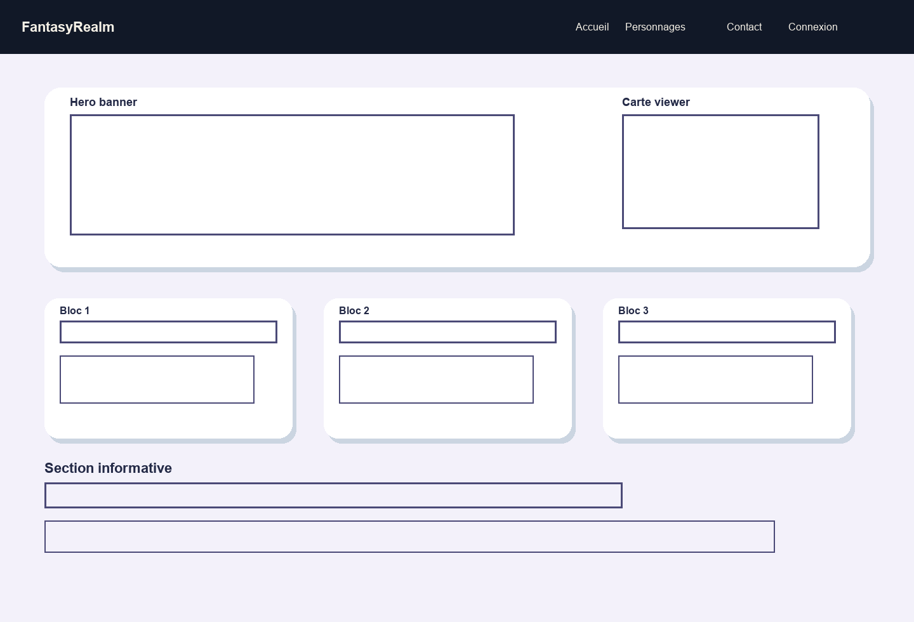

### 4.2 Connexion desktop

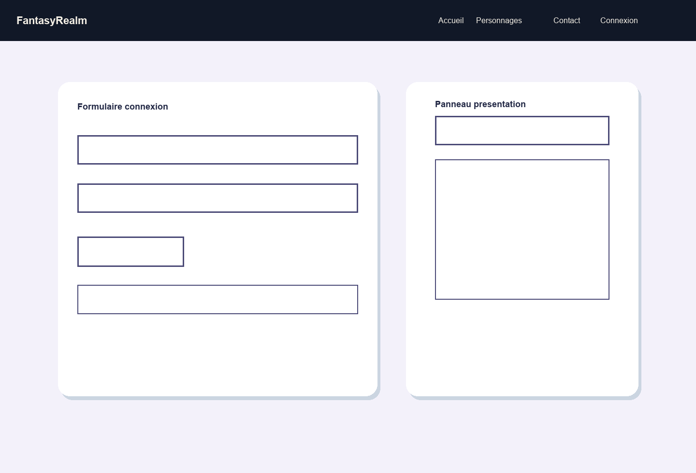

### 4.3 Espace joueur desktop

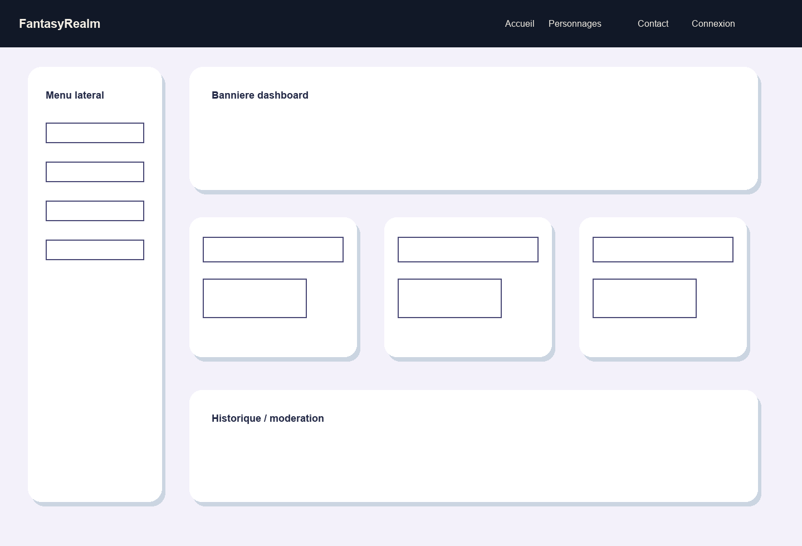

## 5. Wireframes mobile

### 5.1 Accueil mobile

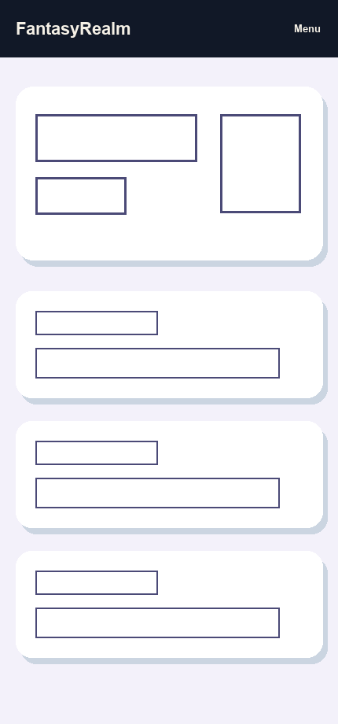

### 5.2 Connexion mobile

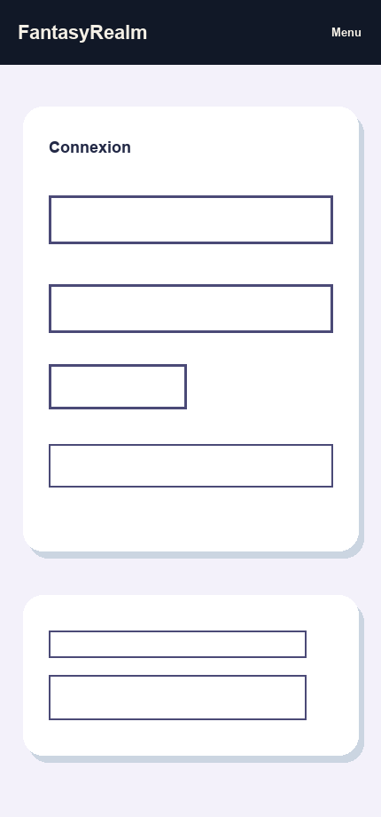

### 5.3 Espace joueur mobile

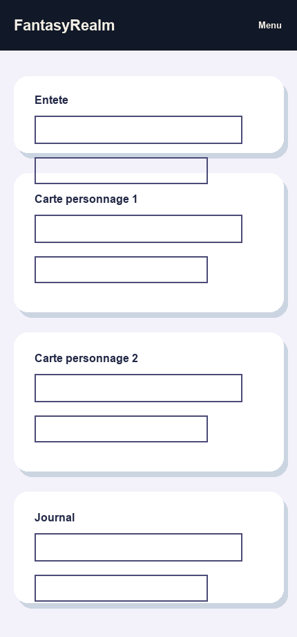

## 6. Maquettes desktop

### 6.1 Accueil desktop

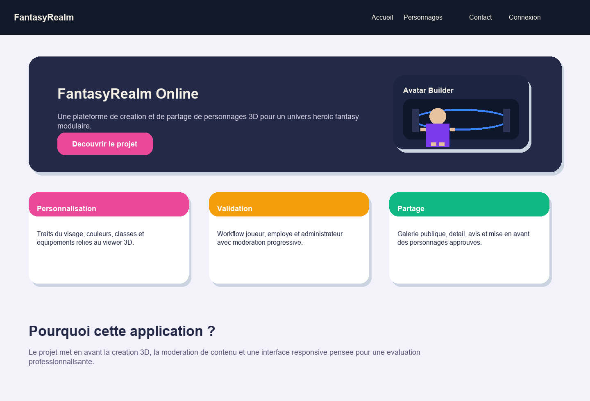

### 6.2 Connexion desktop

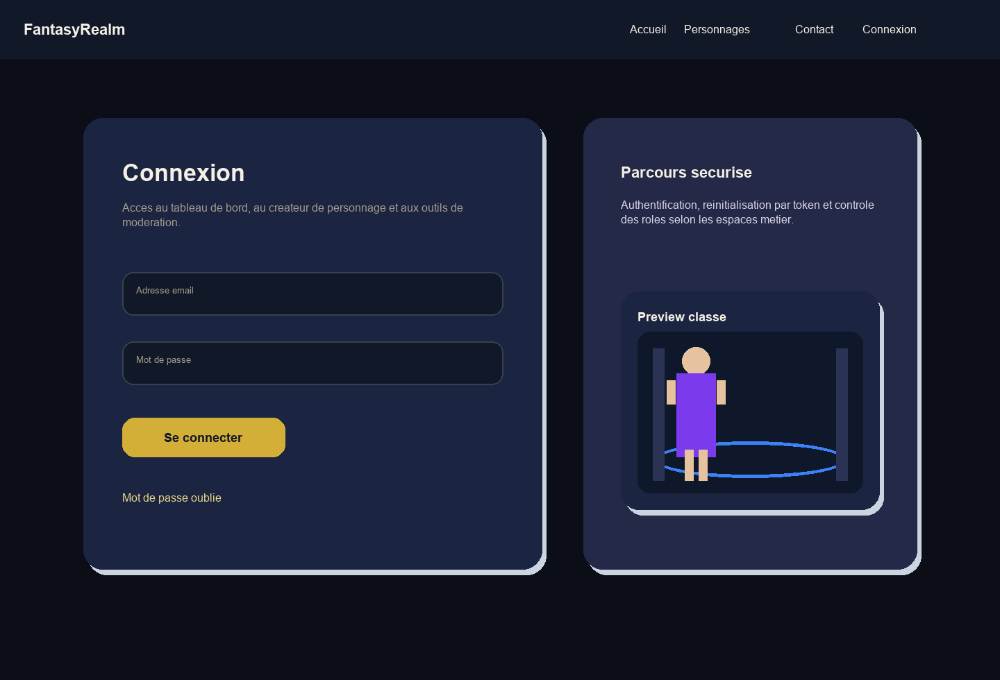

### 6.3 Espace joueur desktop

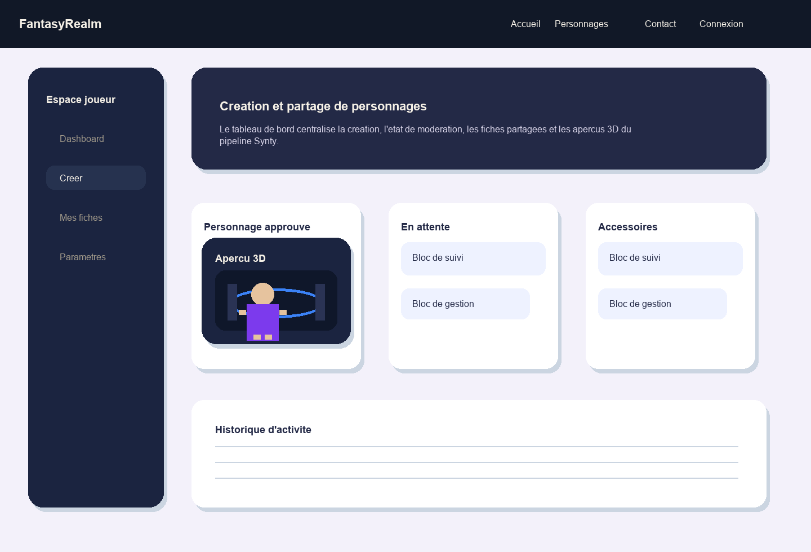

## 7. Maquettes mobile

### 7.1 Accueil mobile

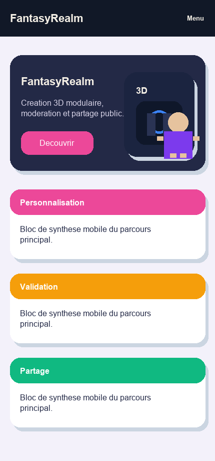

### 7.2 Connexion mobile

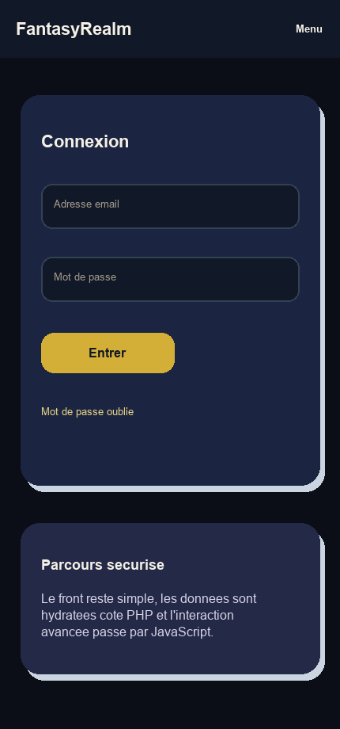

### 7.3 Espace joueur mobile

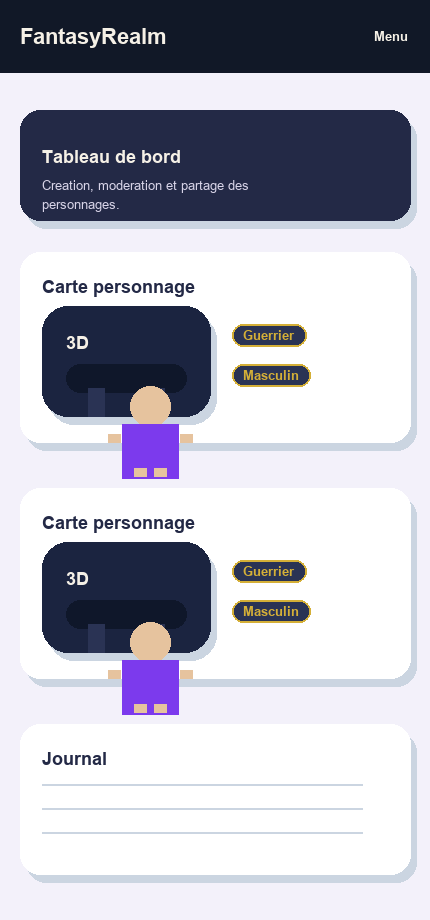

## 8. Accessibilite visuelle

- contraste eleve entre texte principal et fonds sombres ;
- accents reserves aux actions et reperes visuels ;
- structure des ecrans basee sur des titres et sous-titres explicites ;
- couleurs d'etat distinctes pour succes, alerte et erreur ;
- ambiance graphique controlee pour conserver la lisibilite sur desktop et mobile.
